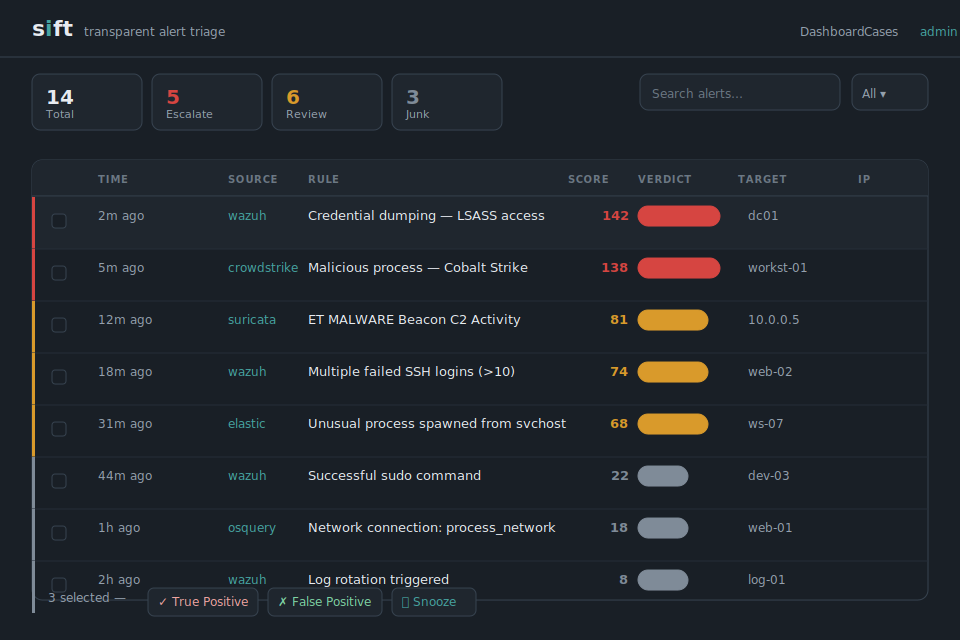
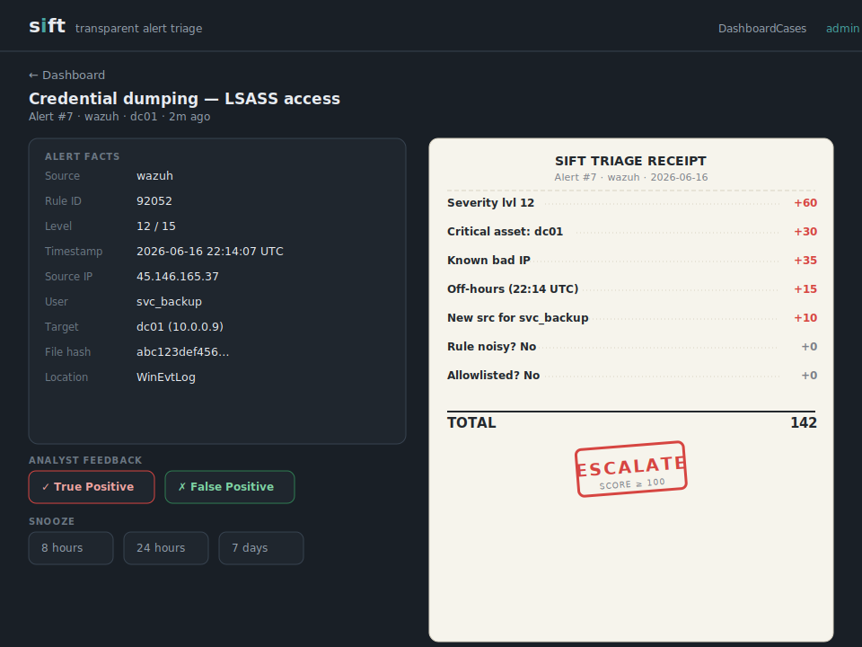
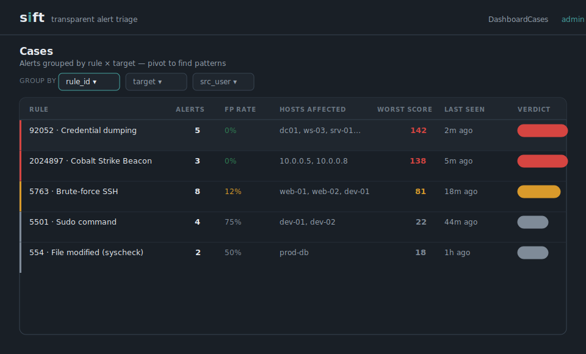

# sift

**Transparent, self-hosted alert triage that explains every decision and learns from your analysts.**

[](https://github.com/saiz123/Sift/actions/workflows/ci.yml)


SOC analysts drown in alerts — hundreds a day, most of them false alarms. Classic SOAR follows rigid playbooks that break on anything new; AI triage products are expensive, closed boxes that say *what* but never *why*. Analysts stop trusting them. Real threats stay buried.

sift is a small, opinionated answer to that gap:

- **It shows its work.** Every alert gets an itemised *receipt* — each signal, the points it added or removed, and a plain-English reason. An analyst can agree or overrule in five seconds.
- **It learns from you.** When an analyst marks an alert a false alarm, the rule that fired it is trusted a little less next time — automatically, visibly, no playbook to rewrite.
- **It runs anywhere.** Pure Python standard library. No `pip install`, no CDN, no web fonts. Clone and run — including on an air-gapped box.
- **No ongoing cost.** Every signal runs on data it already owns. No per-alert API fee, no AI subscription.

---

## Screenshots

**Dashboard** — alert feed with verdict badges, score columns, and bulk-triage controls.



**Alert detail & receipt** — every scoring point explained, one-click feedback, snooze timer.



**Cases** — correlated alerts grouped by rule × target pivot.



---

## Quick start

You need Python 3.10 or newer. No other dependencies.

```bash
git clone https://github.com/saiz123/Sift.git
cd Sift
python cli.py serve
```

In another terminal, load the sample alerts:

```bash
python cli.py reset-demo
```

Open **http://127.0.0.1:8000/** — the dashboard shows 10 sample alerts across all three verdict buckets. Click any alert to see its full receipt.

Or send a single alert from the command line:

```bash
python cli.py send sample_alerts/real_attack.json
```

```
  verdict : ESCALATE   score: 93   (alert #1)
  receipt :
      +48  SIEM severity        —  Wazuh rule level 12 of 15
      +30  Critical asset       —  Target 'dc01' matches critical asset 'dc01'
      +15  Outside business hours  —  Activity at 03:00, outside 08:00-18:00
```

### Docker

```bash
docker compose up
```

The database is persisted to `./data/sift.db`. Override settings via the `environment:` block in `docker-compose.yml` or a `.env` file.

---

## Authentication

Authentication is **off by default** (zero friction on a fresh install). The moment you create a user account, the login page is enforced for all routes.

```bash
# Create your first admin account
python cli.py init-user

# Or specify a role upfront:
python cli.py init-user --role analyst
```

Roles:

| Role | What they can do |
|------|-----------------|
| `admin` | Full access — feedback, snooze, bulk actions, user management |
| `analyst` | Full access to all triage operations |
| `read_only` | Dashboard and alert views only; POST routes return 403 |

Sessions are stored in the database with a 24-hour TTL (`SIFT_SESSION_HOURS`). CSRF tokens are injected into every POST form automatically. Passwords are hashed with PBKDF2-HMAC-SHA256 (260,000 iterations).

---

## CLI reference

```
python cli.py serve              start the sift server
python cli.py send <file.json>   POST an alert file to a running sift
python cli.py init-db            initialise or migrate the database
python cli.py init-user          create a user account (interactive)
python cli.py export             dump all alerts as JSON lines to stdout
python cli.py reset-demo         clear the DB and reload sample_alerts/
```

`send` auto-detects the source type from the JSON shape, so every sample alert works with the same command. Pass `--endpoint /webhook/wazuh` to override.

You can also run the server directly:

```bash
python sift.py          # same as cli.py serve
python -m sift          # same, package entry point
```

---

## How it works

```
   Alert ──POST──▶  /webhook/<source>
                         │
              normalize (flatten the JSON)
                         │
              score  (run every signal check)
                         │
     ┌─────────────────────┼─────────────────────┐
score < 20             20 – 59              score ≥ 60
  JUNK                  REVIEW               ESCALATE
auto-closed,        a human judges        look at this now
kept with reasons   when they can
```

Each alert passes through a set of independent **signals**. A signal either stays silent or adds one line to the receipt: a label, a point value, and a reason. The points sum to a score; the score picks the verdict.

### Scoring signals

| Signal | Points | Notes |
|--------|--------|-------|
| SIEM severity | `level × 4` | Source severity normalised to sift's 0-15 scale |
| Critical asset | +30 | Target matches a substring in `CRITICAL_ASSETS` |
| Malicious IP (AbuseIPDB) | +50 | Requires `ABUSEIPDB_KEY` |
| Threat-feed IP | +50 | abuse.ch Feodo Tracker / SSLBL / local blocklist — free, no key |
| Tor exit node | +15 | Not inherently malicious, scored separately |
| Malicious hash (VirusTotal) | +50 | Requires `VIRUSTOTAL_KEY` |
| Outside business hours | +15 | Activity outside `BUSINESS_START`–`BUSINESS_END` |
| New source for user | +25 | User seen before, but never from this IP |
| IP velocity | +35 | User alerted from 3+ distinct IPs within an hour — impossible-travel pattern, no GeoIP needed |
| Rule activity spike | +10 | Rule firing well above its own historical average |
| Historically noisy rule | up to −45 | Scales with Wilson confidence interval on the FP rate (per-asset once enough data exists) |
| Duplicate flood | −20 | 50+ identical alerts from the same source in 24 h |
| Allowlisted IP | −60 | Source IP is on your trusted list (plain address or CIDR) |
| Allowlisted user | −40 | Source user is on your trusted list |
| Allowlisted hash | −40 | File hash is on your trusted list |

Every weight lives in [`config.py`](config.py). Tune them to your environment.

### The learning loop

On the alert page, an analyst marks each alert **Confirm real threat** or **Mark false alarm**. sift keeps a per-rule tally and penalises noisy rules automatically:

```
First time a noisy rule fires:    REVIEW       (+20, no track record yet)
After 1 'false alarm' verdict:    barely moves (+20 − 9  = +11)
After 12 'false alarm' verdicts:  deep JUNK    (+20 − 34 = −14)
```

The penalty scales with the **lower bound of a Wilson confidence interval** on the false-positive rate — one early false-alarm barely moves the score, and the penalty firms up as more decisions come in. No arbitrary "wait for N observations" cliff.

Once a (rule, target) pair has `NOISY_RULE_MIN_PER_ASSET` or more of its own decisions, the penalty uses that pair's track record instead of the rule's global one — a rule noisy on one host doesn't quiet down everywhere.

### Cases

Related alerts pile up fast — the same compromised account tripping three rules, or one host generating a dozen near-identical detections. `/cases` groups alerts that share a source user, source IP, or target within `CASE_WINDOW_HOURS`, once at least `CASE_MIN_ALERTS` share that value. The case rolls up to the highest verdict among its members; its page has the same bulk-feedback controls as the dashboard.

---

## Supported sources

| Webhook route | What to send |
|--------------|--------------|
| `POST /webhook/wazuh` | Wazuh JSON alert (from a custom integration script — see [Wazuh setup](#wiring-to-wazuh)) |
| `POST /webhook/suricata` | One Suricata `eve.json` line; non-`alert` event types are accepted but silently skipped |
| `POST /webhook/elastic` | Elastic Common Schema (ECS) document — from Kibana's webhook connector, Beats, or Logstash |
| `POST /webhook/guardduty` | AWS GuardDuty finding — from EventBridge or replayed from the console |
| `POST /webhook/m365` | Microsoft Graph Security API alert — Defender for Endpoint, Identity, Cloud Apps, or Sentinel |
| `POST /webhook/crowdstrike` | CrowdStrike Falcon `DetectionSummaryEvent` from the Event Streams API or a webhook |
| `POST /webhook/osquery` | osquery differential result — from Fleet or the osquery logger |
| `POST /webhook/generic` | Any JSON — map fields to sift's schema via `GENERIC_FIELD_MAP` in `config.py`, no Python required |

Every source's severity is normalised onto sift's 0–15 scale, so all thresholds and signals work identically regardless of origin. The receipt's first line always explains the mapping, e.g. *"Suricata severity 1 (1=highest) → level 15 of 15"*.

Try all sources locally:

```bash
python cli.py send sample_alerts/real_attack.json
python cli.py send sample_alerts/suricata_alert.json
python cli.py send sample_alerts/elastic_alert.json
python cli.py send sample_alerts/guardduty_finding.json
python cli.py send sample_alerts/m365_alert.json
python cli.py send sample_alerts/crowdstrike_detection.json
python cli.py send sample_alerts/osquery_result.json
python cli.py send sample_alerts/generic_alert.json
```

`cli.py send` auto-detects the right endpoint from each file's shape.

---

## Wiring to Wazuh

Wazuh delivers alerts to custom integrations via a Python wrapper script. Full setup in five minutes:

**1. Create the integration script**

Save this as `/var/ossec/integrations/custom-sift` on the Wazuh manager:

```python
#!/usr/bin/env python3
"""Wazuh → sift integration. Place at /var/ossec/integrations/custom-sift."""
import json, sys, urllib.request, urllib.error

SIFT_URL   = "http://YOUR_SIFT_HOST:8000/webhook/wazuh"
SIFT_TOKEN = ""   # set to your SIFT_WEBHOOK_TOKEN if configured

def main():
    alert_file = sys.argv[1]
    with open(alert_file, encoding="utf-8") as fh:
        body = fh.read().encode("utf-8")
    headers = {"Content-Type": "application/json"}
    if SIFT_TOKEN:
        headers["X-Sift-Webhook-Token"] = SIFT_TOKEN
    req = urllib.request.Request(SIFT_URL, data=body, headers=headers, method="POST")
    try:
        with urllib.request.urlopen(req, timeout=10) as resp:
            result = json.loads(resp.read())
        print(f"sift: alert #{result['id']} scored {result['verdict']} ({result['score']})")
    except urllib.error.URLError as exc:
        print(f"sift: could not reach {SIFT_URL}: {exc}", file=sys.stderr)
        sys.exit(1)

if __name__ == "__main__":
    main()
```

**2. Set permissions**

```bash
chmod 750 /var/ossec/integrations/custom-sift
chown root:ossec /var/ossec/integrations/custom-sift
```

**3. Add to `ossec.conf`**

Inside `<ossec_config>` on the Wazuh manager:

```xml
<integration>
  <name>custom-sift</name>
  <hook_url>http://YOUR_SIFT_HOST:8000/webhook/wazuh</hook_url>
  <level>3</level>
  <alert_format>json</alert_format>
</integration>
```

`<level>3` forwards everything — let sift's scoring decide what matters.

**4. Restart**

```bash
systemctl restart wazuh-manager
```

---

## Enrichment (optional)

Set API keys via environment variable or in a `.env` file (copy `.env.example` to get started):

```bash
ABUSEIPDB_KEY=...     # source-IP reputation (+50 on a hit)
VIRUSTOTAL_KEY=...    # file-hash reputation (+50 on a hit)
```

Lookups are cached in the database — the same IP or hash is never queried twice within its TTL.

### Free threat-intel feeds (no key required)

On by default. Checked against every incoming source IP:

| Feed | What it blocks |
|------|---------------|
| [abuse.ch Feodo Tracker](https://feodotracker.abuse.ch/) | Known botnet C2 infrastructure |
| [abuse.ch SSLBL](https://sslbl.abuse.ch/) | IPs serving malicious SSL certificates |
| [Tor exit-node list](https://check.torproject.org/torbulkexitlist) | Known Tor exit nodes (scored lower — +15) |

Feeds are fetched over HTTPS and cached for `THREAT_FEED_REFRESH_HOURS` (default 12 h). If a feed is unreachable, sift falls back to the last cached copy — or skips the signal if it's never fetched one. Set `ENABLE_THREAT_FEEDS = False` in `config.py` to turn all feeds off.

For fully air-gapped use, point `SIFT_LOCAL_BLOCKLIST` at a local text file (one IP per line, `#` comments allowed):

```bash
export SIFT_LOCAL_BLOCKLIST=/etc/sift/blocklist.txt
```

---

## Outbound actions (optional)

All actions run on background threads with short timeouts — a slow or unreachable endpoint never blocks alert ingestion.

### Chat webhook (Slack / Mattermost / Discord)

```bash
export ESCALATE_WEBHOOK_URL=https://hooks.slack.com/services/...
```

Posts a short summary for every ESCALATE verdict:

```
sift ESCALATE — alert #3 (score 93)
Rule: 92052 — Credential dumping
Target: dc01  Source: 45.146.165.37
Top signals: SIEM severity (+48); Critical asset (+30); Outside business hours (+15)
```

### TheHive

```bash
export THEHIVE_URL=https://thehive.example.org
export THEHIVE_API_KEY=...
```

Creates a TheHive alert for every ESCALATE verdict, with the full receipt as the description and severity mapped from the score.

### ServiceNow

```bash
export SERVICENOW_INSTANCE=https://dev12345.service-now.com
export SERVICENOW_USER=sift-integration
export SERVICENOW_PASSWORD=...
export SERVICENOW_ASSIGNMENT_GROUP="Security Operations"   # optional
```

Opens a ServiceNow incident for every ESCALATE verdict. Urgency maps from the score (≥ 100 → Critical, ≥ 80 → High, else → Medium).

---

## Configuration

Everything tunable is in [`config.py`](config.py). The main dials:

| Setting | Default | What it does |
|---------|---------|--------------|
| `JUNK_BELOW` | 20 | Score below this → JUNK |
| `ESCALATE_AT` | 60 | Score at or above this → ESCALATE |
| `WEIGHTS` | *(dict)* | Points per signal — the primary tuning surface |
| `CRITICAL_ASSETS` | *(list)* | Substrings matched against alert target |
| `ALLOWLIST_IPS` | *(list)* | Trusted IPs or CIDR ranges |
| `ALLOWLIST_USERS` | *(list)* | Trusted usernames (e.g. service accounts) |
| `ALLOWLIST_HASHES` | *(list)* | Trusted file hashes (e.g. internal tools) |
| `BUSINESS_START/END` | 8, 18 | Local business hours (24-h clock) |
| `CASE_WINDOW_HOURS` | 4 | How recent alerts must be to group into a case |
| `CASE_MIN_ALERTS` | 2 | Minimum alerts sharing a field to form a case |
| `VELOCITY_WINDOW_HOURS` | 1 | Window for impossible-travel IP-count check |
| `VELOCITY_IP_THRESHOLD` | 3 | Distinct source IPs in that window → flag |
| `NOISY_RULE_CONFIDENCE_Z` | 1.96 | Wilson interval z-score (higher = slower to penalise) |
| `NOISY_RULE_MIN_PER_ASSET` | 3 | Decisions before per-asset track record kicks in |
| `ENABLE_THREAT_FEEDS` | True | Toggle all bulk IP feed checks |
| `THREAT_FEED_REFRESH_HOURS` | 12 | How often to re-fetch feeds |
| `GENERIC_FIELD_MAP` | *(dict)* | Dotted-path field map for `/webhook/generic` |
| `SESSION_MAX_HOURS` | 24 | Login session TTL (`SIFT_SESSION_HOURS` env var) |

Edit `config.py`, save, restart sift.

---

## Project layout

```
sift.py                    thin launcher (python sift.py or python -m sift)
cli.py                     CLI: serve / send / init-db / init-user / export / reset-demo
config.py                  every tuning dial and optional integration key
notify.py                  outbound: Slack/Discord chat webhook, TheHive, ServiceNow
send_sample.py             legacy helper (cli.py send is preferred)

sift/
  server.py                ThreadingHTTPServer setup, main()
  routes.py                Handler class, do_GET / do_POST routing, auth helpers
  __main__.py              python -m sift entry point

  core/
    normalize.py           raw alert JSON → flat internal dict (8 source formats)
    checks.py              individual signals — each returns one receipt line or nothing
    scorer.py              gather context, run checks, sum to score + verdict
    enrich.py              AbuseIPDB / VirusTotal lookups + free bulk IP threat feeds

  storage/
    db.py                  SQLite: alerts, rule stats, enrichment cache, users, sessions

  ui/
    views.py               dashboard, alert detail, cases, login page

  handlers/
    dashboard.py           GET /  /alert/<id>  /cases  /case/<dim>/<val>
    webhooks.py            POST /webhook/<source>
    feedback.py            POST /feedback  /snooze  /unsnooze  /bulk-feedback  /login  /logout

tests/
  test_normalize_wazuh.py     17 normalizer tests
  test_normalize_suricata.py  35 normalizer tests (Suricata + CrowdStrike + osquery)
  test_checks.py              26 signal / scoring unit tests
  test_scorer.py              14 scorer integration tests
  test_db_feedback.py         16 database feedback / audit-log tests
  test_webhook_ingest.py      12 end-to-end HTTP round-trip tests

sample_alerts/             one JSON file per source, covers JUNK / REVIEW / ESCALATE
docs/
  screenshots/             SVG UI mockups (regenerate with python docs/make_screenshots.py)
```

---

## Development

**Run the tests**

```bash
python -m unittest discover -s tests -v
```

107 tests, zero external dependencies, runs in under 3 seconds. The CI matrix covers Python 3.10, 3.11, and 3.12.

**Regenerate screenshots**

```bash
python docs/make_screenshots.py
```

**Add a new source**

1. Add a `normalize_<source>(raw)` function to `sift/core/normalize.py` — return `None` to skip, or a flat dict with the standard keys.
2. Add the normalizer to `WEBHOOK_NORMALIZERS` in `sift/handlers/webhooks.py`.
3. Add a sample alert to `sample_alerts/`.
4. Add test cases to `tests/test_normalize_suricata.py` (or a new test file).

Nothing else needs to know which source an alert came from.

---

## Honest limitations

- **Triage, not detection.** sift prioritises alerts your SIEM already produces; it doesn't find new ones.
- **Intentionally simple scoring.** Rule-based and fully auditable — but quality depends on good weights and an active feedback habit.
- **JUNK closes, never deletes.** Every alert and its receipt is retained, so a wrong auto-close is always recoverable.
- **SQLite + stdlib HTTP.** Fine for a team's volume. Not designed for a global MSSP firehose.

---

## Roadmap

Every milestone is held to the same bar: **no AI model, no third-party API required, no ongoing cost**. Self-hosted infrastructure you already run (TheHive, ServiceNow) is fair game; sift talks to it, never depends on it.

| Version | Feature | Status |
|---------|---------|--------|
| v1.0 | Core: scoring engine, Wazuh, learning loop, Slack webhook | ✅ Shipped |
| v1.1 | M365/Graph source, IP velocity, TheHive, per-asset noisy-rule | ✅ Shipped |
| v1.2 | Alert correlation / cases view | ✅ Shipped |
| v1.3 | Free bulk threat-intel feeds (Feodo Tracker, SSLBL, Tor) | ✅ Shipped |
| v1.4 | CrowdStrike + osquery sources, auth + roles, package split, CI, Docker, ServiceNow | ✅ Shipped |
| v1.5 | Metrics dashboard (alert volume over time, top noisy rules, FP rate trends) | Planned |
| v1.6 | MITRE ATT&CK technique tagging on receipt lines | Planned |

Contributions welcome — the codebase is small on purpose so a new signal or a new source is an afternoon, not a project.

---

## License

MIT — do what you like, no warranty.
